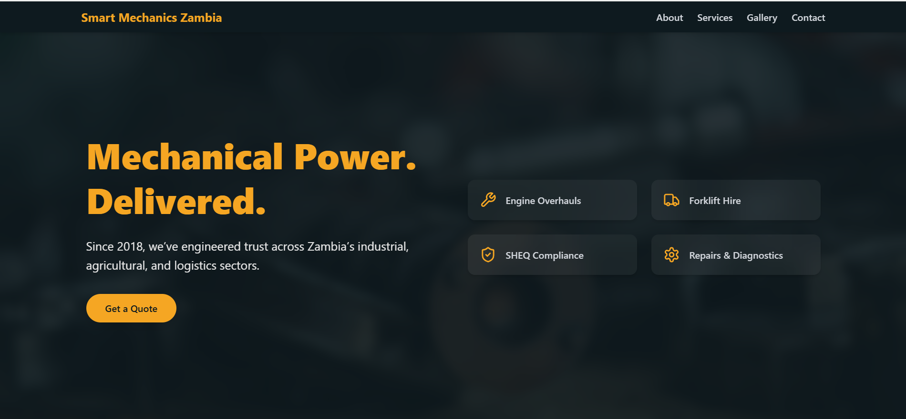

# Smart Mechanics Zambia 🌍🔧

**Delivering Trusted Mechanical & Technical Solutions Across Zambia — Since 2018**

---

## 🧭 Overview

Smart Mechanics Zambia is a leading provider of mechanical and technical solutions for Zambia’s industrial, agricultural, and logistics sectors. This responsive portfolio site was built to showcase our services, build trust, and attract new clients.

---

## ✨ Features

- ⚙️ **Hero Section** with custom animated gear and brand colors
- 👷‍♂️ **About Us** with vision, mission, values, and team section
- 🧰 **Service Listings** — Engine Overhaul, Forklift Hire, Car Hire & more
- 🖼️ **Gallery** with modal image previews
- 📬 **Contact Form** (EmailJS-ready)
- 🔍 **SEO-optimized** metadata and semantic layout
- 🎨 **Custom color palette** matching Smart Mechanics Zambia brand

---

## 🛠 Tech Stack

| Frontend              | Styling       | Animation        | Deployment |
|----------------------|---------------|------------------|------------|
| Next.js 15 (App Dir) | Tailwind CSS  | Framer Motion    | Vercel     |
| TypeScript           | CSS Modules   | Lottie Animations| -          |

---

## 🖼 Screenshots

---

## 🙌 Credits

Built with ❤️ by [Temwani Msiska](https://temwanimsiska.dev)

---

## 📬 Contact Information

- 📧 Email: [smartmechaniczambia@gmail.com](mailto:smartmechaniczambia@gmail.com)  
- 📞 Phone: +260977276638 / +260966558122  
- 📍 Address: Plot No 114/Flat 1, Alick Nkhata Rd, Kabulonga, Lusaka, Zambia  
- 🌐 [Facebook Page](https://web.facebook.com/profile.php?id=100063883634099)

---

## 📄 License

This project is proprietary. All rights reserved © Smart Mechanics Zambia.